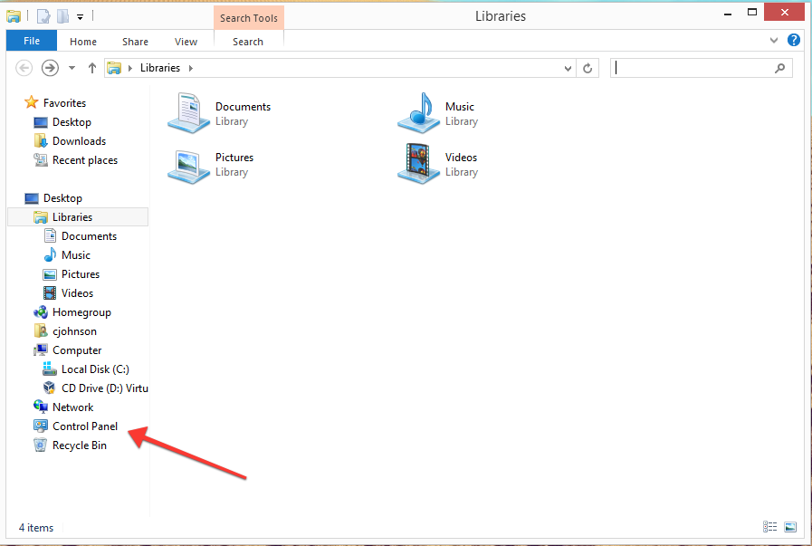
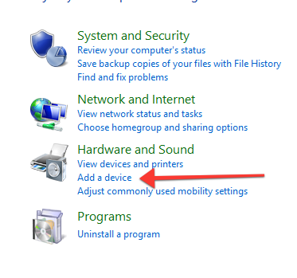
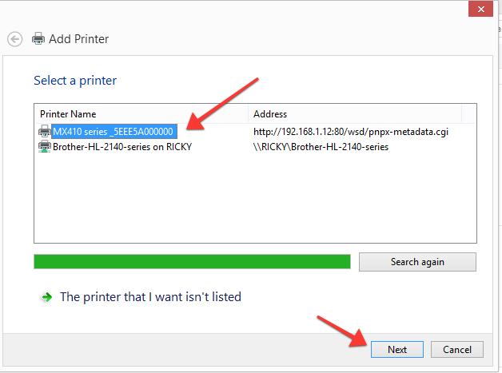
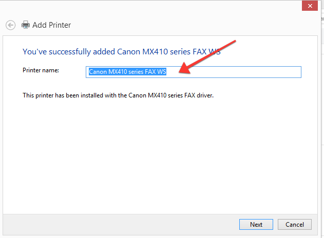
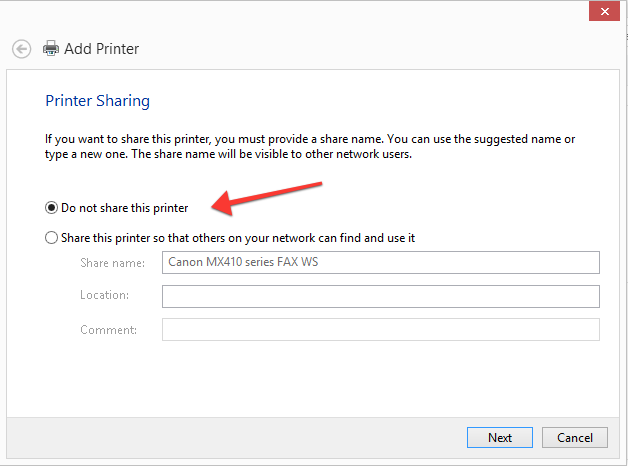
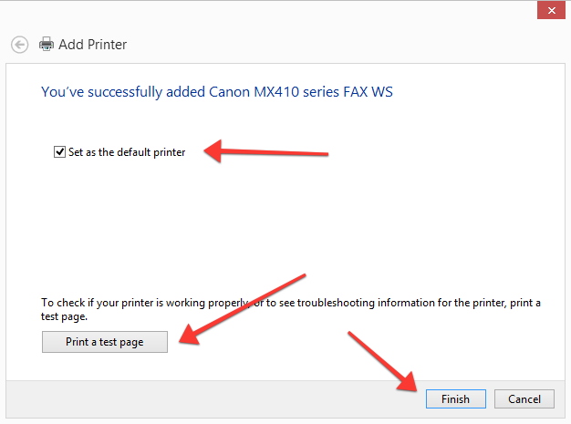

# Adding a printer in Windows 8

- Start by opening the control panel from the task bar.

  

- Next click on the 'Add a device' link under Hardware and Sound.

  

- You should see your printer model show up, click on it and then choose next.

  

- Now you can give your printer a name, the one it defaults to will probably be fine.

  

- Most likely you won't need to share your printer to choose 'do not share'.

  

- To make sure your printer is working, print a test page.

  
